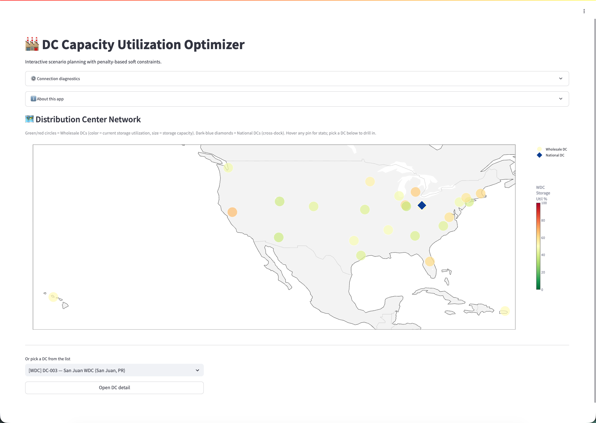
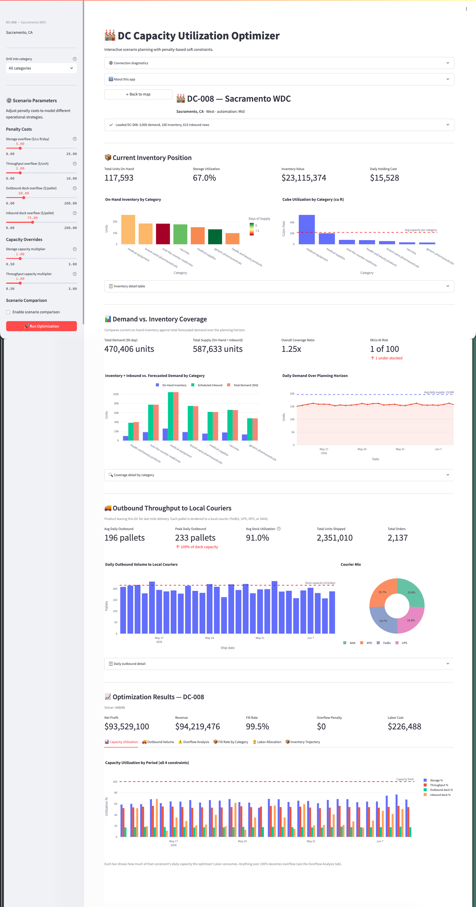
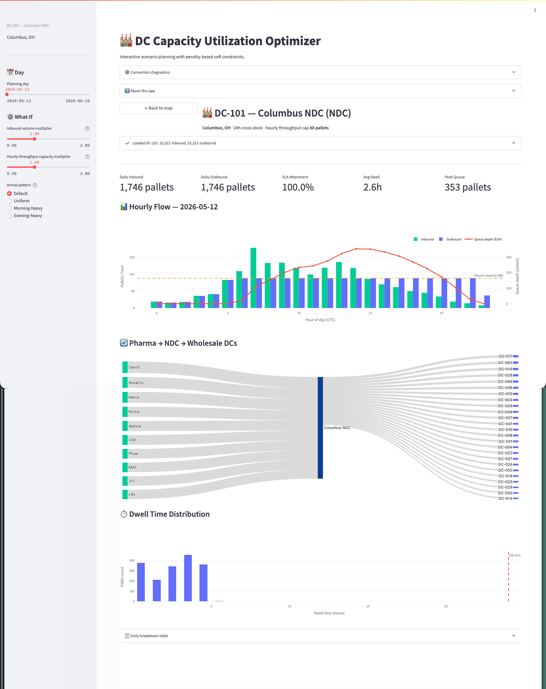

# DC Capacity Optimizer

A multi-DC capacity optimization demo for a pharmaceutical distribution network — a Databricks App + companion notebooks that solve a linear program per Wholesale Distribution Center (WDC), model a National Distribution Center (NDC) cross-dock tier, and visualize utilization, slack, and what-if scenarios across the entire network.

Built on Databricks (Unity Catalog + Lakeflow + Databricks Apps). All tunables live in a single `config.yaml`.

---

## Preview

### Network Map — every DC on a map, colored by storage utilization


### Wholesale DC detail — capacity, inventory, fulfillment, LP results


### National DC cross-dock — pharma inbound → 24h dwell → WDC outbound


---

## What it does

A pharmaceutical distributor operates two tiers:

1. **National Distribution Center (NDC)** — a 24h cross-dock that receives pallets directly from pharma manufacturers (Pfizer, Merck, AbbVie, Lilly, …) and forwards them to regional Wholesale DCs. No storage; SLA is dwell ≤ 24h.
2. **Wholesale Distribution Centers (WDC)** — the storage + pick + ship tier that serves end customers (hospitals, pharmacies). Each WDC has its own storage cube, dock doors, labor pool, and throughput ceiling.

The optimizer answers: *given the inventory I have, the demand I forecast, and the labor / capacity I'm staffed for, what's the most profitable fulfillment plan, and where am I going to hit a capacity wall?*

For each WDC the LP **maximizes**:

$$\text{revenue} - \text{holding cost} - \text{labor cost} - \text{overflow penalties}$$

subject to hard constraints (inventory balance, demand ceiling, labor capacity) and soft constraints with slack variables (storage cube, throughput, inbound dock pallets, outbound dock pallets). A non-zero slack value is the *actionable alert*: the LP is intentionally always feasible — when a constraint must be violated, the penalty cost quantifies the real-world expense of that violation (overflow storage, carrier detention, expediting).

The NDC is modeled separately as a pure-Python what-if simulator over hourly arrival patterns; its outputs feed a Sankey diagram and a dwell-time histogram.

---

## Repo layout

```
.
├── config.yaml                       # single source of truth for all tunables
├── databricks.yml                    # DAB definition (app deploy target)
├── app.yaml                          # Databricks App entrypoint + SQL warehouse binding
├── app.py                            # Streamlit app (network map + DC detail + NDC detail)
├── Generate Synthetic Data.py        # Notebook — populates input tables in tenbosch.scmo_poc
├── DC Capacity Optimization Model.py # Notebook — reference LP solver, looped per DC
├── requirements.txt                  # Python deps
├── screenshots/                      # PNG previews of each view
│   ├── map_view.png
│   ├── ndc_view.png
│   └── wdc_view.png
├── CLAUDE.md                         # Orientation notes for Claude Code sessions
└── README.md                         # this file
```

> **Note** — the two files ending in `.py` that look like scripts are **Databricks notebooks in source form** (`# Databricks notebook source` header, `# COMMAND ----------` cell delimiters, `# MAGIC %md` for markdown cells). They run inside the workspace, not via `python` locally.

---

## `config.yaml` — the contract

A single YAML file is the source of truth for everything tunable. Both notebooks and the app load it on startup; nothing is hard-coded if it can live here instead.

Top-level sections:

| Section | What it controls |
|---|---|
| `schema` | Unity Catalog schema for all tables (`tenbosch.scmo_poc`). |
| `synthetic_data` | Ranges & choices used by the generator (n_skus, planning horizon, demand, inventory, DC capacity envelopes, labor, inbound, outbound). |
| `synthetic_data.skus.categories` | **Per-category economic ranges.** Each of the 7 pharma categories (brand-name pharma, generic pharma, vaccines, OTC, health & beauty, medical supplies, medical equipment) has its own dimensional and economic sub-ranges (cube, weight, revenue, COGS, holding cost). Each SKU draws its category uniformly, then its params from that category's ranges. |
| `ndc` | NDC tier definition — active NDC IDs, hourly capacity / dock doors, simulation parameters (daily inbound pallets, arrival hour-of-day weights, dwell distribution, SLA miss target). |
| `optimization` | LP defaults (regular/overtime labor cost, max hours, throughput rate), slack penalty weights, solver preference (HiGHS first, then CBC), and fallback capacities. |
| `app` | Streamlit UI — cache TTL, slider min/max/default/step for sidebar what-if controls. |

The DC list itself is **not** in `config.yaml` — it's sourced from `tenbosch.scmo_poc.distribution_centers` (filtered to `facility_type='Wholesale DC'`), so the table is the source of truth for which DCs exist.

---

## `Generate Synthetic Data.py` — the data generator

Run this first. It populates the input tables every other piece consumes.

**Tables written to `tenbosch.scmo_poc`:**

| Table | Granularity | Purpose |
|---|---|---|
| `product_master` | one row per SKU | catalog: pharma category, dimensions, unit economics |
| `dc_capacity` | one row per WDC | storage / dock door / throughput envelope |
| `demand_forecast` | (DC, SKU, day) | daily demand forecast over the planning horizon |
| `inventory_levels` | (DC, SKU) snapshot | on-hand inventory sized by days-of-supply × avg demand |
| `labor_availability` | (DC, shift, function, day) | RECEIVING / PICKING / PACKING / SHIPPING headcount + hours |
| `throughput_rates` | (DC, SKU) | units / cases / pallets per labor hour |
| `inbound_plan` | one row per receipt | demand-aware receipts so horizon receipts ≈ horizon demand |
| `outbound_plan` | one row per shipment | planned outbound with priority + carrier |
| `optimization_parameters` | per-DC tunables | objective / constraint / weight params for the LP |
| `ndc_capacity` | one row per NDC | hourly throughput, dock doors, SLA dwell ceiling |
| `ndc_inbound` | one row per arriving pallet | with timestamp + carrier |
| `ndc_outbound` | one row per departing pallet | with dwell hours + SLA flag |

**Schema quality** — every table the generator writes carries:
- A **PRIMARY KEY** constraint (Unity Catalog informational)
- **FOREIGN KEY** constraints to `distribution_centers` and `product_master` (and `ndc_inbound`)
- A table-level **COMMENT** and per-column **COMMENTs**

`distribution_centers` is **not** written by the generator — it's the canonical DC identity table and is the FK target everywhere else. The notebook adds `pk_distribution_centers` on `dc_id` idempotently on first run so the FKs can land.

UC constraints here are informational (not enforced on write); they surface in Catalog Explorer / lineage / query optimizer hints. The generator already produces referentially-correct data.

---

## `DC Capacity Optimization Model.py` — the LP

Reference per-DC LP solver. Loops over every WDC in `dc_capacity`, builds the LP from the input tables, solves it (HiGHS preferred, CBC fallback), and writes per-DC results back to Delta plus a network summary.

The app re-implements the same LP internally in `run_optimization()` (app.py) so it can re-solve on-demand from the sidebar — keep them in sync if you change the objective or constraints.

Mathematical formulation (also rendered in the notebook):

- **Decision variables**: $f_{it}$ (fulfilled units SKU $i$ in period $t$), $I_{it}$ (ending inventory), $L_t$, $O_t$ (regular and overtime labor hours), $s_{kt}$ (slack overflow for each soft constraint).
- **Hard constraints**: inventory balance, demand ceiling, labor capacity (regular + overtime).
- **Soft constraints (with slack & penalty)**: storage cube, throughput units, outbound pallets, inbound pallets.
- **Objective**: max revenue − holding cost − labor cost − $\sum$ slack × penalty.

---

## `app.py` — the Streamlit app

Deployed as a Databricks App; `app.yaml` declares the entrypoint and binds the `sql-warehouse` resource to the `DATABRICKS_WAREHOUSE_ID` environment variable.

Three views, switched via session state:

### 1. Network map
Every DC plotted on a US map. WDCs are colored by current storage utilization (green → red). NDC pins (blue) open a dedicated NDC detail view. Click any DC to drill in.

### 2. Wholesale DC detail (`render_detail`)
Per-DC dashboard:
- **Current Inventory Position** — units, cube, value, holding cost; charts by category (default) or by SKU (drill-down).
- **Demand vs Coverage** — supply (on-hand + inbound) vs total horizon demand, with an at-risk flag rollup.
- **Outbound Throughput** — pallets / units shipped per day vs dock capacity, including carrier mix.
- **What-if sidebar** — penalty cost sliders, capacity multipliers, optional scenario comparison. **Re-runs the LP on click** and displays:
  - Capacity utilization by period (4 constraints)
  - Outbound volume vs dock capacity
  - Overflow analysis (penalty breakdown + physical slack)
  - Fill rate (rolls up to category by default; drills to SKUs when a category is selected)
  - Labor allocation (regular vs overtime per period)
  - Inventory trajectory (total + heatmap)

**Category drill-down**: a sticky sidebar selector flips every SKU-level view between a 7-row category rollup and a per-SKU drill of one category's ~14 SKUs. The LP still solves at SKU granularity — only the display granularity changes. The selection persists across DC switches (`st.session_state["selected_category"]`).

### 3. National DC cross-dock (`render_ndc_detail`)
Pharma → NDC → WDC flow:
- **Day selector** — pick any day in the horizon.
- **Hourly inbound vs outbound** — pallets per hour with the per-hour throughput ceiling.
- **Pharma → NDC → WDC Sankey** — supplier-to-NDC-to-destination-WDC flow for the selected day.
- **What-if sidebar** — inbound volume multiplier, hourly throughput multiplier, and a re-simulated arrival pattern.
- **Dwell-time histogram + SLA attainment** — distribution of pallet dwell hours vs the 24h SLA.

---

## Tech stack

- **Streamlit** (UI)
- **PuLP** with **HiGHS** (preferred) or **CBC** (LP solver)
- **Plotly** (charts, maps, Sankey)
- **databricks-sql-connector** + **databricks-sdk** (data + auth)
- **PyYAML** (config)
- **Unity Catalog** + **Delta** (storage)
- **Databricks Apps** (deploy target)

See `requirements.txt` for pinned minimums.

---

## Running locally

```bash
# Install deps
pip install -r requirements.txt

# Auth to Databricks (one-time)
databricks auth login --host https://<your-workspace>.cloud.databricks.com

# Bind a SQL warehouse so the app can query Unity Catalog
export DATABRICKS_WAREHOUSE_ID=<warehouse_id>

# Run
streamlit run app.py
```

The notebooks must be run **in the workspace**, not locally — they assume a Spark session and use `# COMMAND ----------` cell delimiters.

---

## Deploying to Databricks

Two paths:

```bash
# Path 1 — sync source files into the workspace folder
databricks workspace import "/Users/<you>/dc-capacity-optimizer/config.yaml" \
  --file config.yaml --format AUTO --overwrite
databricks workspace import "/Users/<you>/dc-capacity-optimizer/Generate Synthetic Data" \
  --file "Generate Synthetic Data.py" --format SOURCE --language PYTHON --overwrite
# ... and so on for the other files

# Path 2 — DAB bundle deploy (uses databricks.yml)
databricks bundle deploy -t dev
```

**Pipeline order** (do this first time only):

1. Ensure `tenbosch.scmo_poc.distribution_centers` exists (the DC identity table).
2. Run `Generate Synthetic Data` notebook → populates all 12 input tables with constraints + comments.
3. (Optional) Run `DC Capacity Optimization Model` notebook → reference per-DC LP solve, persists results.
4. Open the deployed Databricks App → re-solve interactively from the sidebar.

---

## Notes

- **Constraints are informational** — Unity Catalog PK/FK constraints declared by the generator are not enforced on write. They are real metadata visible in Catalog Explorer / lineage / query optimizer hints; the generator already produces referentially-correct data.
- **Solver preference** — `optimization.solver_preference: ["highs", "cbc"]` in `config.yaml`. HiGHS is 5–20× faster than CBC on LPs of this shape; CBC is a hard guarantee since it's bundled with PuLP.
- **Categories are uniform random** — each SKU picks one of the 7 pharma categories uniformly. With 100 SKUs the typical mix is ~14 SKUs per category. To bias the mix, add weights (not currently exposed in config).
- **NDC is not part of the LP** — the NDC view runs a pure-Python what-if simulator on `ndc_inbound`/`ndc_outbound`. Keep that separation in mind when extending either side.
